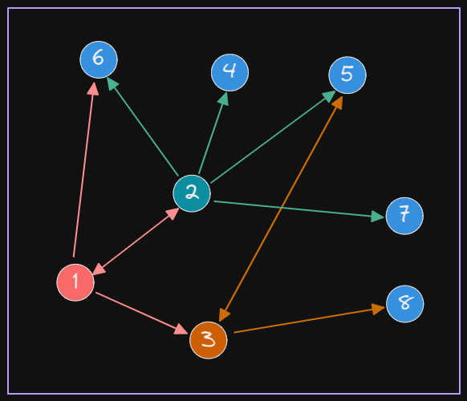
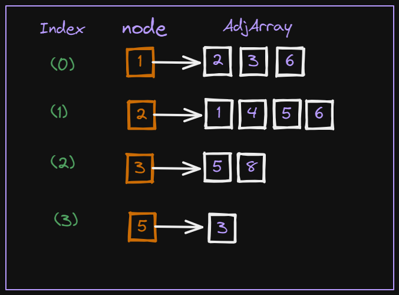
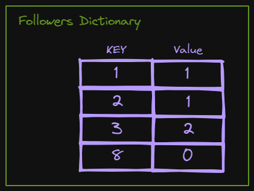

# Twitter Followers
### Project Proposal

In this project, we are given a comma separated file to represent some twitter users and the users they follow. The file name is “twitter.csv”. Each row represents a certain user’s id and the id of another user he/she follows. like the following
```
1,2    //user with id = 1 follows the user with id = 2
2,5    //user with id = 2 follows the user with id = 5
3,5    //user with id = 3 follows the user with id = 5
```

* It is required to make a program that stores this data in a suitable data structure that helps the program to retrieve the **Top-influencer** that has the highest number of followers, when required, and then the next Top-influencer and so on.
* Also, support a complexity analysis illustration to your program’s algorithm in any illustration form; a piece of paper, a presentation slides.
* As a bonus question, you may take a twitter account id from the user and calculate its closest group of twitter users to recommend as a new friend. Closest means they have at least a threshold number of twitter accounts in common. 
  * One of the responsibilities in this bonus task is to determine this threshold.

### Solution Mapping

Suppose we have the following graph:



this will produce the following relations

```
1 --> 2
1 --> 3
1 --> 6
2 --> 1
2 --> 4
2 --> 5
2 --> 6
2 --> 7
3 --> 5
3 --> 8
5 --> 3
```

so we designed a graph data structure that holds all of these nodes (vertices) the relation between each of these nodes (Edges) in an Adjacency array private for each node. And Each of the node will have an index for more ease in manipulation (accessing, inserting , ... ).
This can be represented as follows:



Coding of this approach can be implemented as:

```python
class Graph:
    def __init__(self, nodes, node_id):
        self.adjlist = [[] for i in range(nodes)]   # make empty array (list) to hold all the edges
        self.indexes = {i:j for i,j in zip(node_id, range(nodes))}   #Each node will have an index to be accessed with
        self.followers = {i:0 for i in node_id}     # a dictionary holds number of followers for each node in a (key : 														value) pair as {node_id : num_of_followers}
```

> **Analysis:**
>
> This constructor of the graph just initializes the adjacency list, dictionary of indexes, and followers and all of these operations run in **`O(1)`** 

Firstly we initialize an empty graph

```python
G = Graph(0, [])
```

 and then start looping on the CSV file to add all the vertices and edges, and this can be done as follows:

```python
with open('twitter.csv', 'r') as f:
        results = []
        for line in f:
            words = line.split(',')
            G.AddNode(int(words[0]))
            G.AddNode(int(words[1]))
            G.MakeAdjacent(int(words[0]), int(words[1]))
```

```python
def AddNode(self, node_id):
    if self.isValid(node_id):  #if node is already in graph #O(E)
        return 0
    else:
        self.indexes.update({node_id: len(self.adjlist)})
        self.adjlist.append([])
        self.followers.update({node_id: 0})
```

```python
def isValid(self, node):
    if node in self.indexes:   # if node already present in the graph before
        return 1
    else:
        return 0
```

```python
def MakeAdjacent(self, follower, followed):
    if followed not in self.adjlist[self.indexes[follower]]: # if followed not in the follower adjlist
        self.adjlist[self.indexes[follower]].append(followed)
        self.followers[followed] = self.followers[followed] + 1
```

> **Analysis**:
>
> A loop to get each line in the CSV file separated by comma, indicates the id of follower and the followed nodes
>
> * Adding the follower and followed ids in the graph is done by checking if the node is not present in the graph before
>   this check costs `O(E)` and also it checks for duplicated IDs.
> * if the id is not in the graph , then add it by adding the new id with a new key in the indexes dictionary, and giving it a new adjacency list to put its followers in it later, and adding the new id in the followers dictionary with value = 0 because there is no one follows him till now 
> * if the id has a follower add 1 to its followers number
> * `len() costs O(1) , update costs amortized O(1) ` --> `so AddNode function runs for all edges, which costs O(E)`
> * we connect follower with followed by checking if the followed id is not in the follower adjacency list (this check costs **( V-1)** times in the worst case which means `O(V)`

Now to get the top influencers we sort the followers dictionary, that holds each node_id with its own number of followers, this sorting is using the heap sort technique to sort the array in ascending order then reverse it to be ordered in descending order which will produce the top influencers.



```python
def Get_Influencers(self):  
    p = sorted(self.followers.items(), key=lambda x: x[1], reverse=True) 

    answer = ""
    i = 0
    while (answer.lower() != "n"):
        print("The Influencer with id: {0:<10} has {1:<5} followers ".format(p[i][0], p[i][1]))
        i += 1
        answer = input("Do you want another top follower (Y/N)? : ")

```

> **Analysis**:
>
> The Get_Influencers() function sorts the follower dictionary in descending order to get the top influencer and this costs  `O(V log V)`

If the user wants some suggested friends for a specific id then we go through this id AdjList to get all of his children then we go through all these children's AdjLists to get theire children who are now the Grand children of the main node id.

this will give us a list of nodes that can have a connection with the main node and we the verify that none of them have a previous connection with the main node.

To get the threshold we are giving each of these nodes a counter that counts the number of mutual followers between it and the main node.

```python
def Suggest_Followers(self, node_id, num_of_suggestions):
    node = self.indexes[node_id]
    children = [self.indexes[n] for n in self.adjlist[node]]
    connections = {}
    for child in children:
        grandchildren = self.adjlist[child]
        for vertex in grandchildren:
            if self.indexes[vertex] in children or vertex == node_id:
                continue
            # If connection exists add mutual friends number
            if vertex in connections.keys():
                connections[vertex] += 1
            # Initialise to 1
            else:
                connections[vertex] = 1

    connections = sorted(list(connections.items()), key=lambda x: x[1], reverse=True)

    z = range(num_of_suggestions)
    for i in z:
        print("You can follow {0:<10} you both have {1:<4} in common".format(connections[i][0], connections[i][1]))
```

> **Analysis**:
>
> * Getting children array (node_id.AdjList) is done in `O(1)`
> * Getting index of each of these children costs `O(V)`
> *  looping to get each of the grand children and checking connection costs `O(V²)` 
> * after getting all suggestion sorting it will cost `O( V log(v) )` as it is sorted in heap sort approach.
> * So the total cost of this function is `O(V²)`


## Recourses

* https://stackoverflow.com/questions/1115313/cost-of-len-function

* https://thecodingbot.com/time-and-space-complexity-analysis-of-pythons-list-reverse-method/

* https://www.geeksforgeeks.org/internal-working-of-the-len-function-in-python/#:~:text=Hence%2C%20len()%20function%20in,in%20O(1)%20complexity

  
"# Twitter_Followers" 
